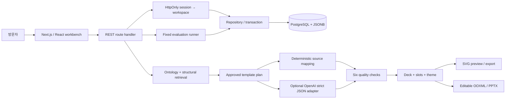

# Architecture and decisions

## 하나의 모델, 여러 출력

`SlideTemplate`은 전달 의도, 레이아웃, 정보 밀도, 테마와 `Slot[]`을 갖는다. 슬롯은 의미 역할, 정규화 좌표, 글자 한도, 필수 여부를 갖는다. `Slide`는 template ID/version, slot values, theme을 분리해서 보관한다. 따라서 스타일 변경은 원문이나 슬롯 값을 변경하지 않는다.

SVG와 PPTX는 같은 슬롯 좌표를 사용한다. PPTX는 `fflate`로 패키징한 최소 OOXML이며 이미지 스크린샷 대신 편집 가능한 텍스트와 도형을 담는다. 발표자 노트에는 원문·템플릿 버전·생성 경로를 남긴다. 글꼴 대체와 각 뷰어의 렌더링 차이까지 동일하다고 주장하지 않는다.

템플릿은 현재 revision만 보관하고 deck의 `templateVersion`으로 변경을 감지한다. 과거 revision의 불변 스냅샷 저장은 아직 범위 밖이다. 수정된 템플릿을 사용하는 deck은 품질 경고가 표시되며, 템플릿을 다시 선택해 원문을 재배치해야 한다. 버전 표시만으로 과거 레이아웃이 보존된다고 간주하면 안 된다.

## 관계형 DB를 사용하는 이유

운영 상태, 버전, workspace 경계는 관계형 컬럼으로 두고 가변적인 디자인 구조는 JSONB로 둔다. JSON만 저장하는 문서 모델과 달리 DB에서 복합 키·외래 키·상태 제약을 적용하며, 데이터 변경과 감사 기록을 한 트랜잭션으로 처리한다.

| 테이블            | 책임                                        |
| ----------------- | ------------------------------------------- |
| `workspaces`      | 세션 토큰 해시, 생성/만료 기준              |
| `templates`       | 검색·상태 컬럼 + 정규화된 JSONB 모델        |
| `decks`           | workspace별 프레젠테이션과 낙관적 버전      |
| `audit_events`    | 등록/수정/검수/생성/실험 이벤트와 근거      |
| `experiments`     | 질의별 순위, 집계, 카탈로그 버전, 실행 시간 |
| `rate_windows`    | workspace·bucket별 분당 요청 제한           |
| `ai_daily_budget` | 모든 세션에 공통인 일별 모델 요청 상한      |

`SELECT … FOR UPDATE` 후 `expectedVersion`을 비교한다. 오래된 클라이언트 요청은 HTTP 409이며 마지막 요청으로 덮어쓰지 않는다. 템플릿 편집은 승인 상태를 초안으로 바꾸고 재검수를 요구한다. 승인 API도 스키마·필수 값·대비·슬롯 오류를 검사한다. 검수 사유와 상태 변경이 함께 커밋되므로 사유 없는 승인을 남기지 않는다.

현재 검색은 SQL로 해당 workspace의 작은 카탈로그를 읽은 뒤 TypeScript에서 랭킹한다. DB에 구조/검색 인덱스가 있지만 GIN 인덱스로 검색 순위를 계산한다고 주장하지 않는다. 100개 데모 제한을 넘어서는 운영 데이터에는 DB 후보군 축소·페이지네이션·검색 인덱스 전략이 필요하다.

## 같은 PostgreSQL 스키마로 로컬과 배포 연결

- `DATABASE_URL`이 있으면 `postgres` 드라이버로 외부 PostgreSQL에 연결한다. 커넥션 풀은 작게 유지하고 서버리스 풀러와 호환되도록 prepared statement를 비활성화한다.
- 로컬에서 URL이 없으면 PGlite의 PostgreSQL 엔진과 `.data/slide-atlas` 파일 저장을 사용한다. 독자적인 가짜 DB 배열이 아니다.
- Vercel에서 URL이 없으면 임시 메모리 모드를 제공한다. 인스턴스 재생성 시 초기화되고 인스턴스 간 공유되지 않는다. 공개 시연 외의 영속 운영에는 사용하면 안 된다.
- 화면 하단과 `/api/health`가 저장 모드를 알린다. 배포 시 실제 모드를 확인한다.

초기 마이그레이션은 idempotent SQL이다. 외부 PostgreSQL에서는 advisory lock 안에서 실행한다. 여러 서비스가 사용하는 장기 운영 DB라면 마이그레이션 이력 테이블과 배포 전용 job으로 분리해야 한다.

## AI 경계와 비용 통제

모델은 OpenAI Responses API와 strict JSON Schema를 사용한다. 입력은 원문과 허용된 슬롯이며, 원문은 명령이 아닌 비신뢰 데이터라고 명시한다. 결과는 Zod로 슬롯 키/용량을 재검증하고 원문에 없는 수치가 생기면 저장하지 않는다. 거절·불완전 응답·타임아웃·스키마 불일치는 성공처럼 표시하지 않는다. 요청 모델, 프롬프트 버전, 토큰 수, 소요 시간을 deck에 기록한다.

기본값은 `AI_ENABLED=false`다. 서버 키, 활성화 플래그, 초대 코드가 모두 있어야 작동한다. 코드 비교는 일정 길이 SHA-256 digest의 timing-safe 비교를 사용한다. 공개 브라우저에 모델 API 키를 전달하지 않는다. 요청 timeout 25초, output token limit 4,000, 세션당 생성 8회/분, 전역 기본 30회/UTC 일 한도가 있다. 실패한 모델 요청도 시도 횟수에 포함한다. 메모리 모드는 이 전역 한도를 여러 인스턴스에 걸쳐 보장하지 못하므로 공개 AI 활성화에는 외부 DB가 필요하다.

수치 존재 검사는 환각 방지의 충분조건이 아니다. 같은 수치를 다른 대상에 연결하거나 맥락·단위를 바꾸는 오류, 숫자 없는 사실의 환각은 사람이 검토해야 한다. 프롬프트 인젝션에 대한 지시문만으로 안전성을 보장하지 않으며 모델에 도구 실행·DB·배포 권한을 주지 않는다.

참고: [OpenAI Structured Outputs](https://developers.openai.com/api/docs/guides/structured-outputs), [PGlite filesystems](https://pglite.dev/docs/filesystems), [Next.js Route Handlers](https://nextjs.org/docs/app/api-reference/file-conventions/route).
