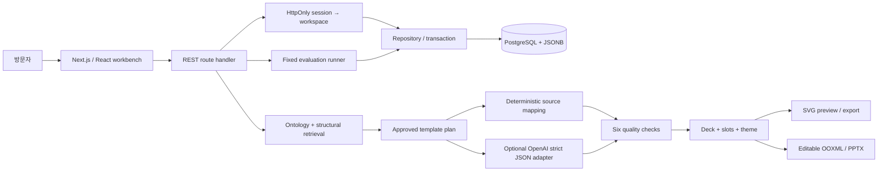

# 아키텍처와 기술 선택

## 하나의 데이터 모델로 여러 형식 생성

`SlideTemplate`은 전달 의도, 레이아웃, 정보 밀도, 테마와 `Slot[]`으로 구성됩니다. 슬롯에는 내용의 역할, 정규화된 좌표, 글자 수 제한, 필수 여부를 지정합니다. `Slide`에서는 템플릿 ID와 버전, 슬롯 값, 테마를 분리해 저장하므로 스타일을 바꿔도 원문과 슬롯 내용은 유지됩니다.

SVG와 PPTX는 같은 슬롯 좌표를 사용합니다. PPTX는 필요한 OOXML 파일을 생성한 뒤 `fflate`로 묶으며, 텍스트와 도형을 편집 가능한 개체로 저장합니다. 발표자 노트에는 원문, 템플릿 버전, 생성 방식을 남깁니다. 다만 글꼴 대체나 뷰어의 렌더링 방식에 따라 최종 표현은 달라질 수 있습니다.

템플릿을 등록·수정·검수할 때마다 `template_versions`에 변경 불가능한 JSONB 사본을 저장하고, 검수 화면에서는 최근 20개 가운데 실제 내용이 달라진 이전 버전과 현재 버전을 비교합니다. 프레젠테이션의 각 슬라이드에도 생성 당시 `templateVersion`을 기록해 최신 버전과 달라졌는지 품질 검사에서 감지합니다. 다만 프레젠테이션이 과거 사본을 외래 키로 직접 참조하지는 않으며, 과거 버전으로 되돌리거나 일괄 재배치하는 기능은 아직 제공하지 않습니다.

## 관계형 DB를 사용하는 이유

검수 상태, 버전, 작업 공간 식별자는 관계형 컬럼으로 관리하고, 템플릿마다 달라지는 디자인 구조는 JSONB에 저장합니다. 이렇게 나누면 DB의 복합 키·외래 키·상태 제약을 활용하면서 디자인 구조도 유연하게 표현할 수 있습니다. 데이터 변경과 감사 이력은 하나의 트랜잭션으로 처리합니다.

| 테이블              | 책임                                        |
| ------------------- | ------------------------------------------- |
| `workspaces`        | 세션 토큰 해시, 생성 시점과 만료 기준       |
| `templates`         | 검색·상태 컬럼 + 정규화된 JSONB 모델        |
| `template_versions` | 템플릿별 변경 불가능한 버전 JSONB 스냅샷    |
| `decks`             | 작업 공간별 프레젠테이션과 충돌 감지용 버전 |
| `audit_events`      | 등록/수정/검수/생성/실험 이벤트와 근거      |
| `experiments`       | 질의별 순위, 집계, 카탈로그 버전, 실행 시간 |
| `rate_windows`      | 작업 공간·기능별 분당 요청 수               |
| `ai_daily_budget`   | 모든 세션에 공통인 일별 모델 요청 상한      |

수정할 때는 `SELECT … FOR UPDATE`로 해당 행을 잠근 뒤 `expectedVersion`을 비교합니다. 클라이언트가 오래된 버전을 수정하려고 하면 HTTP 409를 반환해 최신 내용을 덮어쓰지 않도록 합니다. 승인된 템플릿을 편집하면 상태를 초안으로 바꾸고 다시 검수하도록 했습니다. 승인 API에서도 스키마, 필수 값, 색 대비, 슬롯 구조를 확인하며, 검수 사유와 상태 변경을 함께 저장합니다.

현재 검색은 SQL로 해당 작업 공간의 템플릿 목록을 조회한 뒤 TypeScript에서 점수를 계산하는 방식입니다. DB에 구조·검색용 인덱스가 있지만, 검색 순위를 GIN 인덱스로 계산하지는 않습니다. 템플릿을 100개까지 허용하는 데모 범위를 넘어 규모를 확대하려면 DB에서 검색 후보를 줄이고, 페이지네이션과 인덱스 활용 방식을 추가로 설계해야 합니다.

## 로컬과 배포 환경의 DB 구성

- `DATABASE_URL`이 설정되어 있으면 `postgres` 드라이버로 외부 PostgreSQL에 연결합니다. 커넥션 풀은 최대 4개로 제한하고, 서버리스 연결 풀과 호환되도록 prepared statement를 비활성화합니다.
- 로컬에서 URL을 설정하지 않으면 PGlite의 PostgreSQL 엔진을 사용하고 `.data/slide-atlas`에 데이터를 저장합니다. 애플리케이션 내부 배열을 DB처럼 사용하는 방식은 아닙니다.
- Vercel에서 URL을 설정하지 않으면 임시 메모리 모드로 동작합니다. 이 모드에서는 인스턴스가 다시 생성될 때 데이터가 초기화되고 인스턴스 간 저장도 공유되지 않으므로, 작업 보존이 필요한 운영 환경에는 외부 DB를 연결해야 합니다.
- 화면 하단과 `/api/health`에 실제 저장 방식을 표시합니다. 공개 서비스의 연결 상태와 검증 결과는 [배포·검증 기록](verification.md)에서 확인하실 수 있습니다.

초기 스키마 SQL은 반복 실행해도 같은 구조가 유지되도록 작성했습니다. 외부 PostgreSQL에서는 advisory lock을 사용해 여러 인스턴스가 동시에 초기화하지 않도록 합니다. 여러 서비스가 함께 사용하는 장기 운영 DB로 확장할 때는 마이그레이션 이력 테이블과 별도의 배포 작업으로 분리하는 것이 후속 과제입니다.

## AI가 변경할 수 있는 범위와 비용 제한

AI 연동에는 OpenAI Responses API와 엄격한 JSON Schema를 사용합니다. 원문과 허용된 슬롯을 전달하고, 원문에 포함된 문장을 시스템 명령으로 취급하지 않도록 지시합니다. 응답은 Zod로 슬롯 키와 내용량을 다시 검증하며, 원문에 없는 수치가 포함되면 저장하지 않습니다. 생성 거절, 불완전한 응답, 시간 초과, 스키마 불일치는 오류로 처리합니다. 사용한 모델, 프롬프트 버전, 토큰 수, 소요 시간은 프레젠테이션에 기록합니다.

기본 설정은 `AI_ENABLED=false`이며, 서버 전용 키·활성화 설정·초대 코드가 모두 있어야 동작합니다. 초대 코드는 고정 길이 SHA-256 해시로 변환한 뒤 비교 시간 차이로 정보가 드러나지 않도록 확인합니다. 모델 API 키는 브라우저로 전달하지 않습니다. 요청당 최대 25초, 출력 토큰 최대 4,000개, 세션당 분당 생성 8회, 서비스 전체의 기본 일일 AI 요청 30회로 제한합니다. 일일 한도는 UTC 날짜를 기준으로 계산하며, 실패한 요청도 시도 횟수에 포함합니다. 이 한도를 여러 인스턴스에서 공유해야 하므로 공개 AI 기능을 활성화하려면 외부 DB가 필요합니다.

공개 서비스에는 전용 Neon DB와 `gpt-4.1-mini`를 연결하고 초대 코드 방식의 AI 생성을 활성화했습니다. API 키와 초대 코드는 Vercel Production의 `Secret`으로 관리하며, 미리보기·개발 배포에는 전달하지 않습니다. 실제 연결과 사용 흐름은 [API 검증 기록](live-ai-verification.json)과 [브라우저 검증 기록](live-ai-browser-verification.json)에 남겼습니다. 토큰 수는 API가 반환한 사용량이며 실제 청구 금액은 별도로 검증하지 않았습니다.

원문에 같은 수치가 있는지 확인하는 것만으로 AI의 사실 오류를 막을 수는 없습니다. 수치가 다른 대상에 연결되거나 맥락·단위가 바뀌는 문제, 숫자가 없는 잘못된 주장 등은 사람이 검토해야 합니다. 프롬프트 지시문만으로 안전성을 보장하지 않도록 모델에는 도구 실행, DB 접근, 배포 권한을 부여하지 않았습니다.

구현 시 참고한 공식 문서는 [OpenAI Structured Outputs](https://developers.openai.com/api/docs/guides/structured-outputs), [PGlite 파일 시스템](https://pglite.dev/docs/filesystems), [Next.js Route Handlers](https://nextjs.org/docs/app/api-reference/file-conventions/route)입니다.
