# Slide Atlas 기능 및 UI/UX 감사 보고서

- 감사 일자: 2026-09-01
- 대상: [공개 서비스](https://slide-atlas-mu.vercel.app)와 당시 소스 코드
- 화면 크기: 데스크톱 1280×900, 모바일 390×844
- 기준 사용자: 처음 방문한 프로젝트 평가자와 프레젠테이션 템플릿을 등록, 생성, 검수하고 평가하는 운영자
- 확인 범위: 스튜디오, 라이브러리, 검수 인박스, 실험실, 프로젝트 가이드, 발표 화면, 내보내기 메뉴, 모바일 반응형, 콘솔 오류, 자동화 테스트와 API 경계

> **과거 검증 기록:** 이 문서와 이미지는 2026-09-01 당시의 화면입니다. 전체 UI 리메이크 이후의 모습은 [최신 스크린샷](../../screenshots/README.md)과 [2026-09-05 디자인 QA](../../../design-qa.md)를 참고해 주세요.

> **문서 읽는 방법:** 아래 `개선 전 사용자 여정별 상태`부터 `개선 전 구현 순서 제안`까지는 최초 감사 시점의 기준선과 발견 사항을 보존한 기록입니다. 당시 개선 상태와 완료 판정은 `개선 반영 결과` 이후에서 확인하실 수 있습니다.

## 판단

현재 프로젝트는 **공개 포트폴리오로 검토할 수 있는 수준**입니다. 브리프 입력부터 구조 검색, 슬롯 기반 편집, 품질 검사, 검수, 검색 실험과 PPTX 내보내기까지 하나의 제품 흐름으로 연결되어 있습니다. 구현 근거는 문서와 테스트에서 확인할 수 있으며, 치명적인 사용성 결함이나 공개 화면의 콘솔 오류는 발견하지 못했습니다.

가장 큰 개선 기회는 **운영자가 다음 작업으로 자연스럽게 이동하도록 연결하고, 변경과 검수 및 실험의 근거를 비교 가능한 형태로 보여주는 일**입니다. 각 기능은 개별적으로 동작하지만 라이브러리→스튜디오, 검수→변경점 확인, 실패 질의→다음 실험의 연결이 약합니다.

## 개선 전 사용자 여정별 상태

### 1. 진입과 프로젝트 이해 — 양호, 발견성 보완 필요

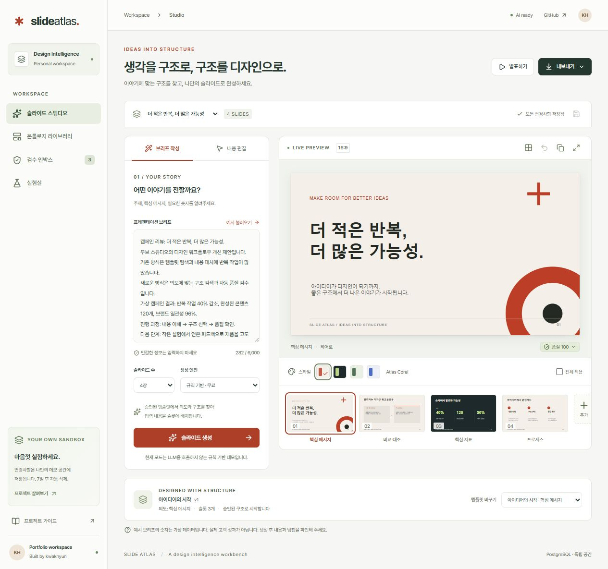

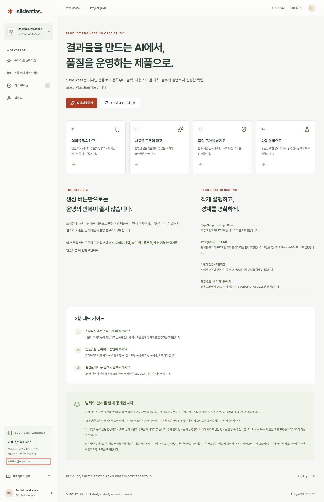

**잘된 점**

- 첫 화면에서 브리프, 생성 방식, 미리보기, 스타일, 품질 상태를 함께 확인할 수 있습니다.
- 규칙 기반 모드와 OpenAI 모드를 분리하고, 가상 데이터와 AI 한계를 명확하게 안내합니다.
- 별도의 프로젝트 가이드는 문제 정의, 기술 선택, 3분 데모, 한계를 한 화면에 정리하여 포트폴리오 설명력이 좋습니다.

**개선점**

- 기본 경로가 바로 스튜디오로 연결되어 처음 방문한 평가자가 전체 제품 이야기를 놓칠 수 있습니다.
- 사이드바 하단의 프로젝트 가이드는 핵심 기능보다 발견성이 낮습니다.
- 첫 화면의 정보 밀도가 높아 무엇부터 눌러야 하는지 스스로 판단해야 합니다.

**권장 변경**

- 첫 방문에만 `1. 예시 생성 → 2. 템플릿 교체 → 3. 실험 확인` 체크리스트를 노출합니다.
- 헤더에 `3분 데모` 또는 `이 프로젝트의 문제 정의` 링크를 추가합니다.
- 루트 경로는 스튜디오로 유지하되, 첫 방문 안내 배너에서 프로젝트 가이드로 연결합니다.

### 2. 생성·편집·내보내기 — 양호, 편집 운영성 보완 필요

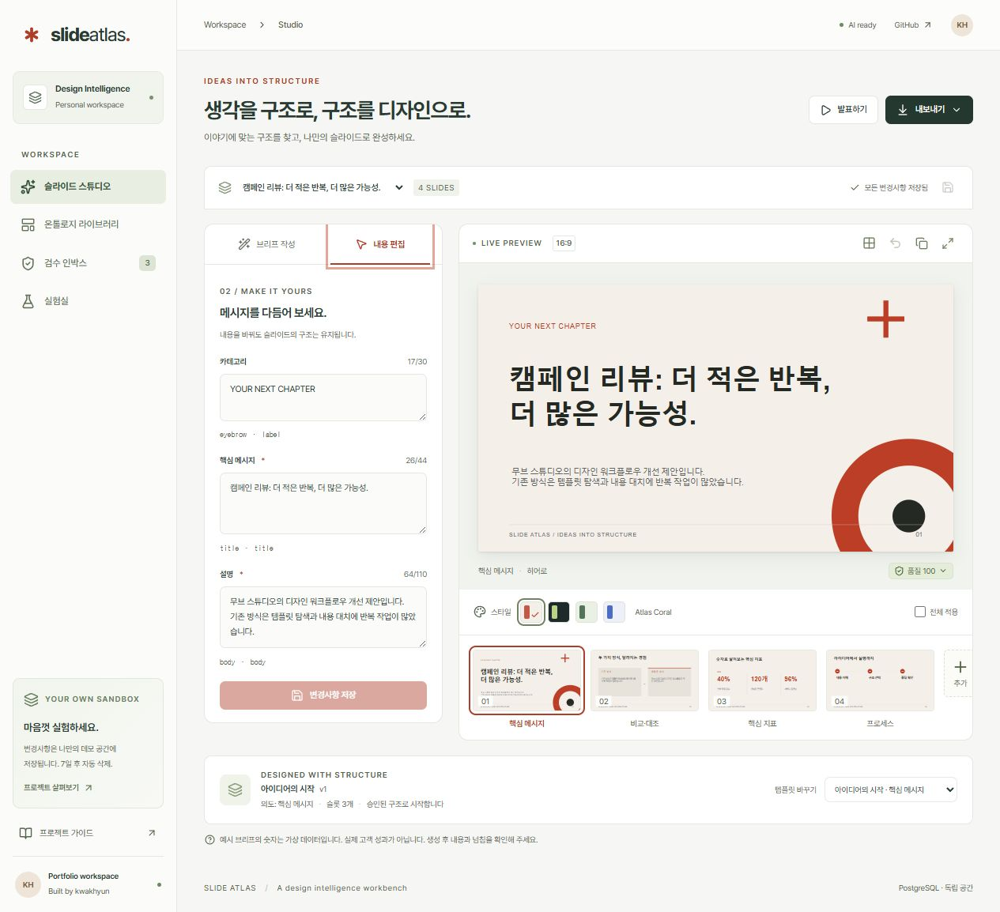

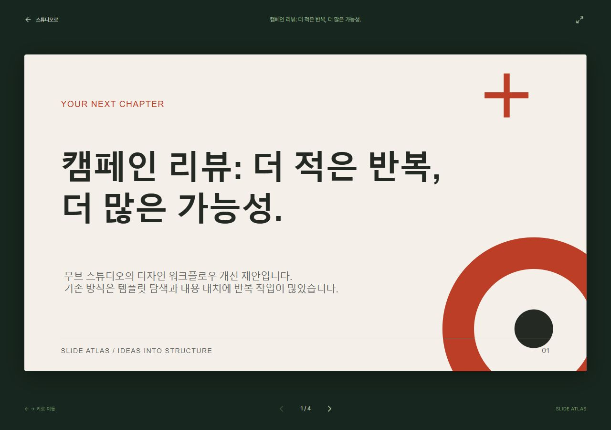

**잘된 점**

- 입력과 16:9 결과를 나란히 보여 주어 내용 변경 결과를 즉시 확인할 수 있습니다.
- 템플릿 구조, 글자 수, 테마, 전체 적용, 되돌리기, 복제, 품질 검사를 한 흐름에 배치했습니다.
- PPTX, 현재 슬라이드 SVG, 구조 JSON의 차이를 메뉴 안에서 설명합니다.
- 발표 화면은 키보드 이동, 전체 화면, 현재 장수 안내를 제공합니다.

**개선점**

- 프레젠테이션 이름 변경, 프레젠테이션 삭제·복제, 슬라이드 순서 변경·삭제, 다시 실행은 제공하지 않습니다. 현재 슬라이드 관리 기능은 복제와 되돌리기에 집중되어 있습니다.
- 저장 동작이 상단 아이콘과 내용 편집 패널의 버튼으로 중복되어 있습니다.
- 생성 중 기존 미리보기가 그대로 남아 새 결과가 준비 중인지 이전 결과를 보고 있는지 혼동될 수 있습니다.
- 낙관적 잠금 충돌은 오류 알림만 표시하며, 서버 버전 불러오기나 내 변경 보존 경로가 없습니다.
- AI 모델, 프롬프트 버전, 토큰, 소요 시간은 저장하지만 화면에서 확인할 수 없습니다.

**권장 변경**

- 프레젠테이션 메뉴에 이름 변경, 복제와 삭제를 추가하고, 필름스트립에는 드래그 순서 변경, 삭제와 다시 실행을 추가합니다.
- 저장 진입점을 하나로 통합하고 `마지막 저장 14:32`처럼 상태를 명시합니다.
- 생성 중 미리보기를 흐리게 처리하고 `구조 검색 → 슬롯 배치 → 품질 검사`의 3단계 진행 상태를 표시합니다.
- 409 충돌 시 `서버 버전 불러오기`와 `내 변경 JSON 내려받기`를 제공해 데이터 유실을 막습니다.
- AI 생성 결과의 모델, 프롬프트 버전, 토큰, 소요 시간과 남은 일일 요청 수를 접을 수 있는 근거 패널에 표시합니다.

### 3. 온톨로지 검색·관리 — 양호, 다음 행동 연결 필요

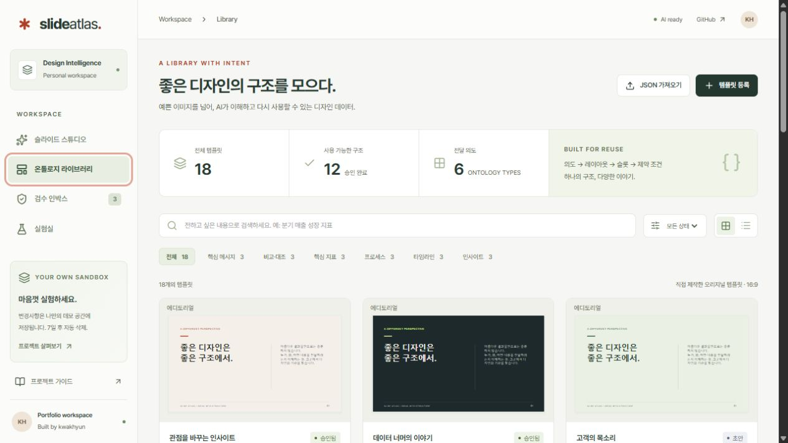

**잘된 점**

- 검색어, 상태, 전달 의도, 그리드·목록 보기를 조합할 수 있습니다.
- 검색 결과에 점수와 이유를 노출하는 구조가 이미 있으며, 빈 결과의 복구 동작도 제공합니다.
- 상세 화면에서 실제 슬라이드, 슬롯 영역, 의도, 레이아웃, 용량, 버전, 원본 JSON을 함께 확인할 수 있습니다.
- JSON 가져오기, 복제, 초안 저장, 수정 후 재검수 흐름이 잘 갖춰져 있습니다.

**개선점**

- 템플릿 상세 화면의 주요 동작은 `복제하여 등록`과 `템플릿 수정`뿐입니다. 승인 템플릿을 확인한 뒤 곧바로 스튜디오에서 사용하는 동작이 없습니다.
- 기본 화면에서는 검색 점수의 구성과 정렬 기준을 알기 어렵습니다.
- 현재 18개에서는 문제가 없지만 정렬, 페이지 구분, 저장된 필터가 없어 데이터가 늘면 운영 속도가 떨어질 수 있습니다.
- 카드 미리보기가 같은 레이아웃끼리 매우 비슷하여 템플릿 차이를 한눈에 구분하기 어렵습니다.

**권장 변경**

- 승인 템플릿 상세 화면에 `이 템플릿으로 만들기`를 주요 버튼으로 추가하고 스튜디오에 선택 상태를 전달합니다.
- 검색 결과에 `관련도순`, `최근 수정순`, `상태순` 정렬을 추가하고, 점수 툴팁에서 키워드, 의도, 구조와 용량의 기여도를 설명합니다.
- 데이터가 100개를 넘는 시점을 기준으로 서버 페이지 구분 또는 가상 스크롤을 적용합니다.

### 4. 검수 인박스 — 양호, 변경 비교가 핵심 과제

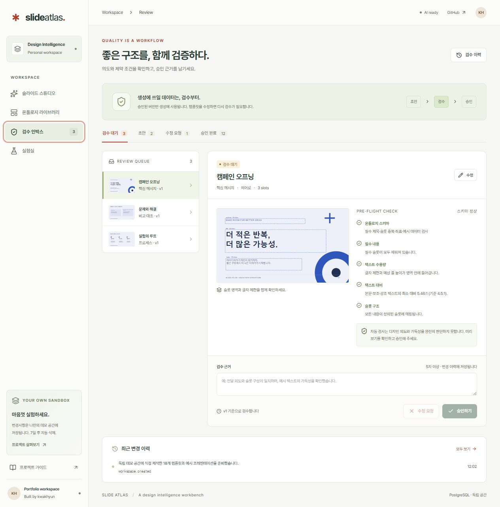

**잘된 점**

- 상태별 건수, 검수 목록, 실제 미리보기, 자동 검사, 검수 근거, 승인·수정 요청을 한 화면에 배치했습니다.
- 검수 근거를 5자 이상 작성해야 하고 버전을 함께 저장하여 책임 있는 승인 흐름을 만듭니다.
- 자동 검사와 사람의 판단 범위를 구분한 안내가 적절합니다.

**개선점**

- 검수 대상이 이전 버전에서 무엇이 바뀌었는지 확인할 수 없습니다.
- 현재 문서는 과거 템플릿 배치의 변경 불가능한 사본을 보관하지 않으므로 과거 상태를 완전히 재현할 수 없습니다.
- 승인 버튼이 비활성화된 이유를 버튼 근처에서 바로 설명하지 않아 처음 사용하는 사람은 메모 길이와 품질 조건을 추론해야 합니다.

**권장 변경**

- 템플릿 버전 스냅샷을 저장하고 슬롯, 용량, 레이아웃과 샘플 문구의 변경점을 나란히 비교합니다.
- 승인 조건을 `검수 근거 5자 이상`, `오류 0개`, `스키마 정상` 체크리스트로 버튼 위에 표시합니다.
- 충돌이나 수정 요청 후에는 변경된 항목만 다시 확인할 수 있게 합니다.

### 5. 실험실 — 매우 양호, 반복 실험 도구로 확장 필요

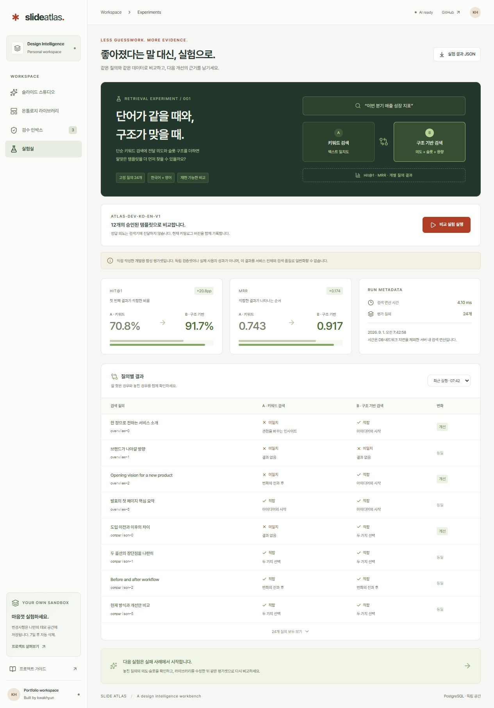

**잘된 점**

- Hit@1과 MRR의 의미, 비교군 A/B, 실행 시간, 질의 수, 질의별 성공·실패를 함께 보여 줍니다.
- 직접 작성한 개발용 합성 평가셋이며 실제 사용자 성과가 아니라는 한계를 정직하게 공개합니다.
- 실험을 실행할 때 실제 결과를 저장하고 JSON 근거를 내려받을 수 있습니다.

**개선점**

- 실행 이력은 시각으로만 구분하며 두 실행의 차이를 직접 비교할 수 없습니다.
- 실패·개선·하락 사례만 거르는 필터가 없습니다.
- 하단의 `다음 실험은 실패 사례에서 시작합니다` 카드는 화살표 때문에 눌러질 것처럼 보이지만 실제 동작이 없습니다.
- 평가셋 버전과 카탈로그 버전은 문구로만 설명되며 실행 간 변경 내용을 확인하기 어렵습니다.

**권장 변경**

- 실행 두 개를 선택해 지표·질의별 결과·카탈로그 버전 차이를 비교합니다.
- `실패만`, `개선만`, `하락만` 필터와 CSV 내보내기를 추가합니다.
- 하단 카드를 실제 버튼으로 바꾸고 실패 질의의 전달 의도로 필터된 라이브러리 화면에 연결합니다.
- 실행 결과에 평가셋 해시와 승인 카탈로그 해시를 표시하여 재현성을 강화합니다.

### 6. 모바일 — 안정적, 편집 방식 최적화 필요

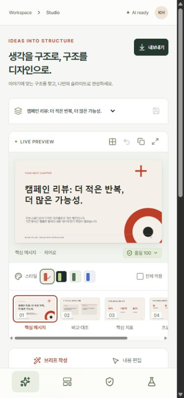

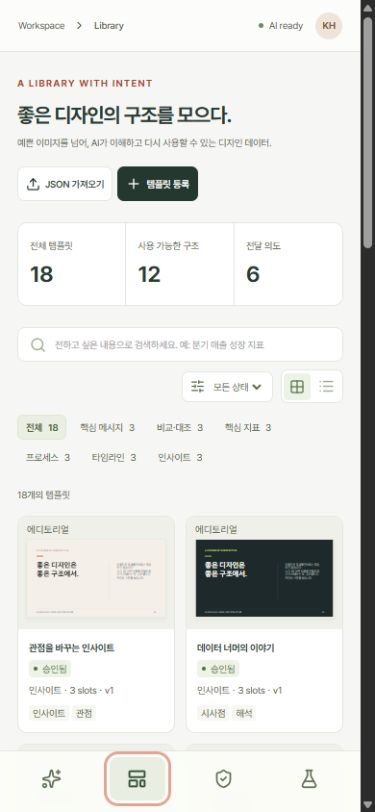

**잘된 점**

- 390×844에서 페이지 전체의 가로 넘침이 없고 하단 내비게이션이 안정적으로 동작합니다.
- 라이브러리의 검색, 필터, 통계, 2열 카드가 작은 화면에서도 깨지지 않습니다.
- 주요 버튼과 상태가 텍스트와 아이콘을 함께 사용합니다.

**개선점**

- 모바일 스튜디오는 미리보기, 필름스트립, 브리프·내용 편집이 길게 쌓여 입력과 결과를 번갈아 보기 어렵습니다.
- 축소된 슬라이드 안의 문구는 읽기 어려워 편집 중 확인 도구로서 효율이 낮습니다.
- 고정 하단 내비게이션이 차지하는 공간 때문에 세로 편집 영역이 더 줄어듭니다.

**권장 변경**

- 모바일에서는 `입력`과 `미리보기`를 상단 분할 탭으로 제공하고, 저장·품질 상태만 고정합니다.
- 필름스트립은 한 줄 가로 스크롤을 유지하되 현재 장을 중앙으로 자동 이동합니다.
- 미리보기를 탭하면 확대 편집 모드로 전환하고 다시 탭하면 입력 화면으로 돌아오게 합니다.

### 7. 접근성·신뢰·오류 상태 — 양호, 수동 검증 범위 명시 필요

**잘된 점**

- 스킵 링크, 내비게이션·메인 랜드마크, 올바른 제목 구조, 폼 레이블, 탭 역할, 상태 알림, 아이콘 버튼 이름을 확인했습니다.
- 템플릿 편집 대화상자에는 이름과 포커스 트랩이 있으며 Escape로 닫을 수 있습니다.
- 데스크톱과 모바일 5개 주요 경로에 WCAG A/AA axe 검사와 가로 넘침 검사가 자동화되어 있습니다.
- 이번 공개 서비스 점검 중 콘솔 오류와 경고는 발생하지 않았습니다.

**개선점**

- `품질 100`은 오류·경고 개수에 가중치를 적용한 규칙 점수이므로 실제 디자인 품질을 100점으로 검증한 것처럼 받아들일 수 있습니다.
- 자동 접근성 검사는 발표 화면, 모든 팝오버와 메뉴, 실제 화면 낭독기 사용성, 200% 확대, 고대비 모드를 모두 보장하지 않습니다.
- 저장되지 않은 변경 경고는 페이지 이탈과 링크 클릭을 처리하지만 브라우저의 같은 문서 뒤로가기를 별도로 다루지 않습니다.

**권장 변경**

- `품질 100`을 `자동 검사 6/6 · 오류 0 · 경고 0`처럼 근거 중심 표현으로 바꿉니다.
- 발표 화면과 내보내기 메뉴를 자동 접근성 범위에 추가하고 NVDA 또는 Narrator로 생성→편집→저장 흐름을 수동 확인합니다.
- 뒤로가기와 충돌 상황에서도 변경을 보존할 수 있도록 임시 초안 또는 복구 JSON을 제공합니다.

## 개선 전 우선순위

치명적 제출 차단 요소는 없습니다. 다음 순서로 개선하면 투자 대비 효과가 큽니다.

| 우선순위 | 개선 항목                                      | 기대 효과                                             | 완료 기준                                                                                          |
| -------- | ---------------------------------------------- | ----------------------------------------------------- | -------------------------------------------------------------------------------------------------- |
| P1       | 라이브러리→스튜디오, 실패 질의→라이브러리 연결 | 작업이 하나의 운영 흐름으로 이어집니다                | 템플릿 상세와 실험 하단에서 선택 문맥을 유지한 채 다음 화면으로 이동합니다                         |
| P1       | 검수 버전 스냅샷과 변경점 비교                 | 검수 근거가 명확해집니다                              | 이전·현재 버전의 슬롯, 용량, 레이아웃, 문구 차이를 확인하고 승인할 수 있습니다                     |
| P1       | 프레젠테이션과 슬라이드 관리, 충돌 복구        | 반복 사용 가능한 내부 도구가 됩니다                   | 프레젠테이션 이름 변경, 복제와 삭제, 슬라이드 순서 변경과 삭제, 다시 실행 및 409 복구가 가능합니다 |
| P1       | 품질 표현을 근거 중심으로 변경                 | 과도한 신뢰를 줄이고 검수 기준을 명확히 합니다        | 점수 대신 통과·오류·경고 수와 각 검사 근거를 우선 표시합니다                                       |
| P2       | 모바일 입력·미리보기 분할 모드                 | 작은 화면에서도 입력과 결과를 빠르게 오갈 수 있습니다 | 390px에서 한 번의 탭으로 입력과 확대 미리보기를 전환합니다                                         |
| P2       | AI 진행 단계, 생성 근거와 남은 예산 표시       | 생성 상태와 사용량을 파악할 수 있습니다               | 생성 단계와 모델, 프롬프트, 토큰, 시간 및 남은 요청 수를 확인할 수 있습니다                        |
| P2       | 실행 간 비교와 실패 사례 필터                  | 실험 결과가 다음 개선으로 이어집니다                  | 두 실행 비교, 실패, 개선 및 하락 필터, 평가셋과 카탈로그 해시를 제공합니다                         |
| P3       | 첫 방문 3분 데모 체크리스트와 문구 정리        | 프로젝트 구조와 사용 순서를 빠르게 파악할 수 있습니다 | 첫 방문 안내와 주요 한국어 레이블을 적용하고 다시 열 수 있습니다                                   |

## 개선 전 구현 순서 제안

1. **1일 차:** 템플릿 사용 버튼, 실험 후속 버튼, 품질 레이블, 첫 방문 체크리스트를 추가합니다.
2. **2~4일 차:** 프레젠테이션·슬라이드 관리, 충돌 복구, 모바일 입력·미리보기 탭을 구현합니다.
3. **5~8일 차:** 템플릿 버전 스냅샷·변경 비교와 실험 실행 비교를 구현합니다.
4. **마무리:** 실제 운영자 3~5명에게 같은 과제를 수행하게 하고 완료 시간, 오류, 되돌아가기 횟수를 기록합니다.

## 개선 반영 결과

위에서 제안한 P1부터 P3까지의 항목은 모두 구현했습니다. 라이브러리에서 Studio로 이어지는 템플릿 적용, 템플릿 버전 스냅샷과 변경점 비교, 프레젠테이션과 슬라이드 관리, 충돌 복구를 추가했습니다. 근거 중심의 품질 표시, 모바일 입력과 미리보기 전환, AI 진행 및 실행 근거, 실험 실행 비교와 필터, CSV 내보내기, 후속 탐색, 첫 방문 3분 안내도 제품 흐름에 반영했습니다.

후속 검토에서는 PPTX의 텍스트, 좌표와 글자 크기를 온톨로지 후보로 바꾸는 제한된 추출 PoC를 추가했습니다. 콘텐츠, 온톨로지, 편집, 검수와 실험 담당자의 완료 기준을 역할 기반 Playwright 시나리오 5개로 고정해 모두 통과했고, 이 과정에서 발견한 이름 저장 버튼 회귀도 수정했습니다. Library 상세 화면과 등록 및 가져오기 기능, Studio 대화상자와 전역 스타일은 기능 단위 파일로 분리했습니다.

구현 중 브라우저 검증에서 개발 모드의 이중 effect 실행으로 URL 템플릿 적용이 누락되는 문제와, 최초 검수 화면에서 버전 데이터가 없을 때 예외가 발생하는 문제를 추가로 발견해 수정했습니다. 새 UI에서 확인된 색상 대비 문제도 WCAG A/AA 자동 검사 기준에 맞게 보완했습니다.

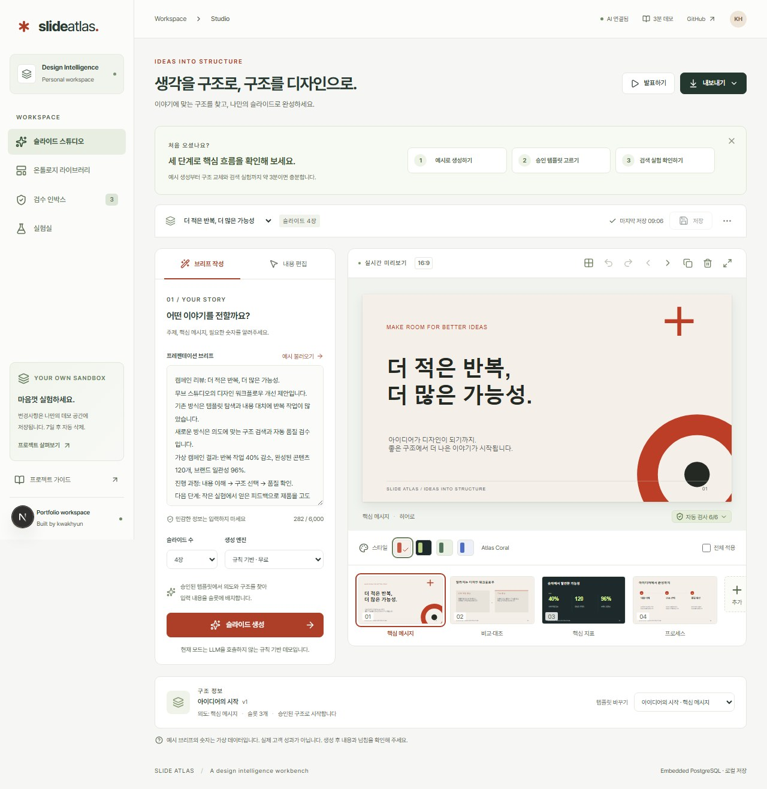

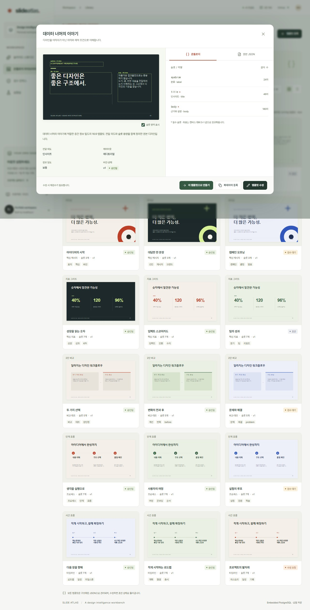

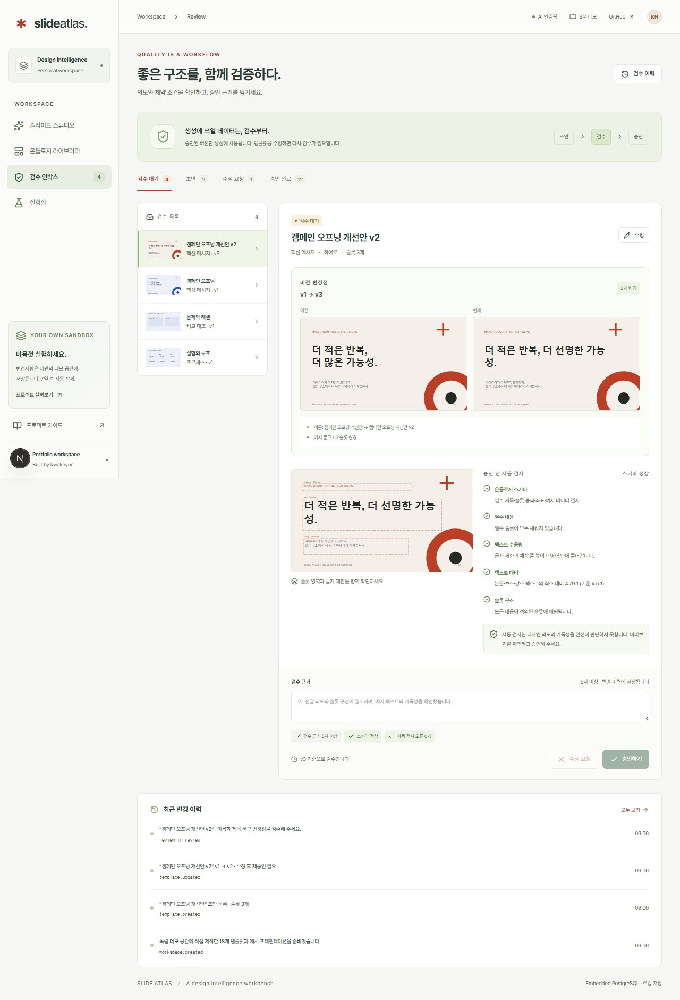

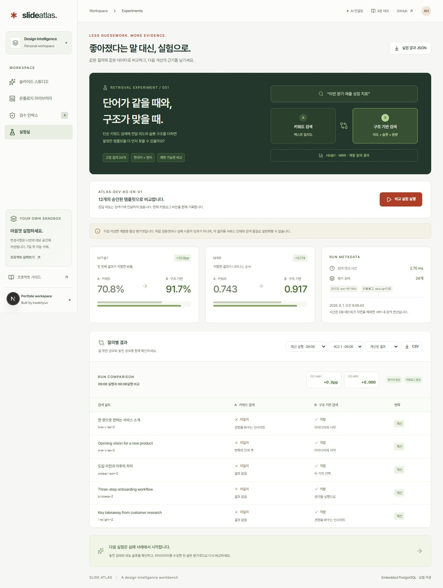

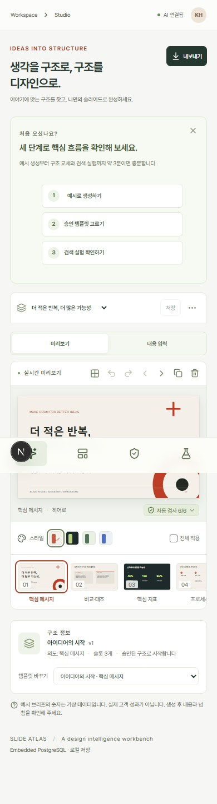

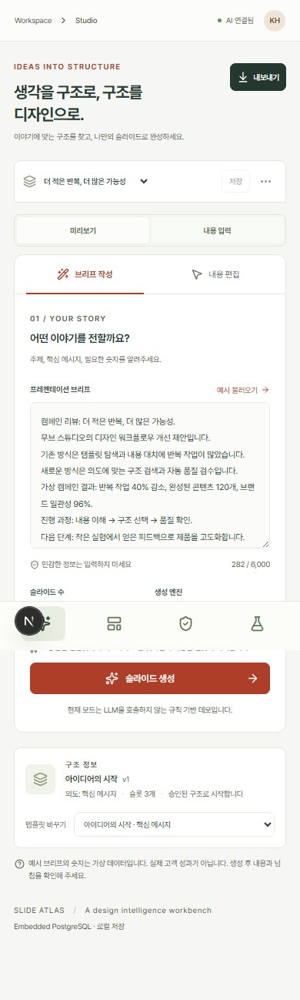

| 우선순위 | 결과 | 검증 근거                                                               |
| -------- | ---- | ----------------------------------------------------------------------- |
| P1       | 완료 | 라이브러리→Studio 적용, 버전 비교, 덱·슬라이드 관리, 충돌 복구 시나리오 |
| P2       | 완료 | 모바일 전환, AI 실행 근거, 실험 실행 비교·필터·CSV 시나리오             |
| P3       | 완료 | 첫 방문 3분 안내와 한국어 우선 레이블, 데스크톱·모바일 접근성 검사      |

## 남은 개선점

현재 범위에서 즉시 수정해야 할 P1~P3 결함은 남아 있지 않습니다. 다음 항목은 실제 운영 데이터와 조직 권한 체계가 있어야 검증할 수 있는 후속 과제입니다.

- 운영자 3~5명을 대상으로 과업 완료 시간, 되돌아간 단계, 도움 요청 횟수를 측정해 첫 방문 안내와 검수 흐름을 조정해야 합니다.
- SSO·RBAC과 승인자 분리, 다수 운영자의 실시간 변경 알림은 실제 조직 정책에 맞춰 설계해야 합니다.
- 템플릿이 수백~수천 개로 늘어날 경우 PostgreSQL 전문 검색·벡터 검색과 페이지네이션의 효과를 별도 데이터셋으로 검증해야 합니다.
- OpenAI 품질은 다양한 실제 브리프와 사람 평가를 통해 정확성·가독성·사실 보존 기준을 추가로 측정해야 합니다.
- 템플릿 변경이 기존 프레젠테이션에 미치는 영향을 자동으로 재평가하는 배치 작업과 마이그레이션 정책이 필요합니다.

## 근거와 한계

- 공개 서비스에서 익명 작업 공간으로 새 프레젠테이션과 검색 비교 실험을 실행했습니다. 이 데이터는 서비스의 7일 보관 정책을 따릅니다.
- 구현 커밋 `e906878`의 소스와 테스트를 대조했습니다. 저장소에는 프레젠테이션 생성과 저장, PPTX 생성과 추출, 발표, 템플릿 등록→검수→승인, 실험 실행, API 충돌, 데스크톱과 모바일 접근성 시나리오가 포함되어 있습니다.
- 실제 화면 낭독기, 느린 네트워크, 여러 사용자의 동시 편집, 실제 PowerPoint 앱별 렌더링, 운영자 인터뷰는 이번 감사 범위에 포함하지 않았습니다.
- 역할·권한, 대규모 검색, 장기 비용과 사용자 성과는 프로젝트 문서에서도 후속 과제로 명시되어 있습니다.
